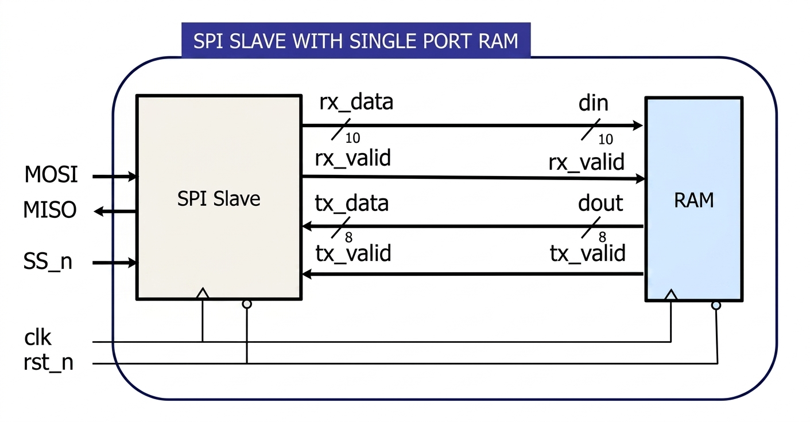
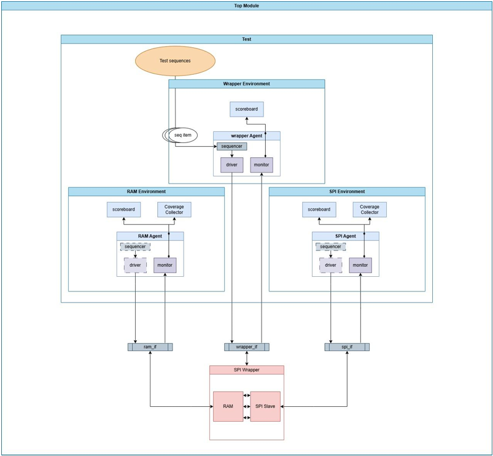

# SPI-Slave-with-RAM-UVM-verification

A complete **Universal Verification Methodology (UVM)** testbench for verifying an SPI Slave with a Single-Port RAM system. The project is structured in three parts, each building on the previous to demonstrate environment reuse.


---

## Project Overview

The design under test (DUT) is an **SPI Wrapper** that integrates an SPI Slave with a Single-Port RAM. Serial data comes in through the SPI interface, gets decoded, and is written to or read from the RAM accordingly.



---

## Repository Structure

```
SPI-Slave-RAM-UVM-Verification/
│
├── README.md
├── run.do                  # QuestaSim simulation script (all parts)
├── src_files.list          # Compilation file list
│
├── SPI_Slave/
│   ├── design/             # SPI Slave RTL & Golden Model
│   └── uvm/                # Full UVM environment for SPI Slave
│
├── RAM/
│   ├── design/             # RAM RTL & Golden Model
│   └── uvm/                # Full UVM environment for Single-Port RAM
│
├── SPI_Wrapper/
│   ├── design/             # SPI Wrapper RTL & Golden Model
│   └── uvm/                # Wrapper UVM env (reuses SPI & RAM envs)
│
├── tb/                     # Top-level testbench modules
├── shared/                 # Shared package
└── reports/                # Coverage & bug reports
   
```

---

## Part 1 — UVM Environment for SPI Slave

Verifies the standalone SPI Slave design.

**Key Features:**
- **Sequences:** `reset_sequence`, `main_sequence`
- **Constraints:** rst_n deasserted 98% of the time; SS_n high every 13 cycles (normal) or 23 cycles (READ_DATA); valid MOSI command bits only (`000`, `001`, `110`, `111`)
- **Functional Coverage:** Coverpoints on `rx_data[9:8]` (all values + transitions), `SS_n` (normal & extended transactions), `MOSI` command bins, and cross coverage between `SS_n` and `MOSI`
- **Assertions:** Reset output check, `rx_valid` assertion, FSM transition checks (`IDLE→CHK_CMD`, `CHK_CMD→WRITE/READ_ADD/READ_DATA`, back to `IDLE`) 
- **Coverage Achieved:** 100% FSM, Branch, Statement, Toggle, and Functional coverage

---

## Part 2 — UVM Environment for Single-Port RAM

Verifies the RAM design with default parameters (`MEM_DEPTH=256`, `ADDR_SIZE=8`).

**Key Features:**
- **Sequences:** `reset_sequence`, `write_only_sequence`, `read_only_sequence`, `write_read_sequence`
- **Constraints:** Controlled operation ordering (Write Address → Write Data, Read Address → Read Data); 60/40 probability distribution after Write Data and Read Data in mixed sequences
- **Functional Coverage:** `din[9:8]` coverpoints for all 4 operation types, transition coverage (`write_addr→write_data`, `read_addr→read_data`), cross coverage with `rx_valid` and `tx_valid`
- **Assertions:** Reset check, `tx_valid` deasserted during non-read operations, `tx_valid` rises after `read_data_seq`, write address eventually followed by write data, read address eventually followed by read data
- **Coverage Achieved:** 100% Branch, Statement, Toggle, and Functional coverage

---

## Part 3 — UVM Environment for SPI Wrapper

End-to-end verification of the full SPI Wrapper design, reusing the SPI Slave and RAM environments as **passive agents**.

**Key Features:**
- **Sequences:** `reset_sequence`, `write_only_sequence`, `read_only_sequence`, `write_read_sequence`
- **Environment Reuse:** SPI and RAM environments instantiated in passive mode inside the wrapper environment; all three interfaces (`wrapper_if`, `spi_if`, `ram_if`) monitored simultaneously
- **Assertions:** MISO inactive on reset, MISO stable during non-read-data operations
- **Coverage:** Reuses functional coverage from SPI and RAM environments; 100% toggle coverage on wrapper interface signals

---

## UVM Architecture



---

## Coverage Results Summary

| Part | FSM | Branch | Statement | Toggle | Functional |
|------|-----|--------|-----------|--------|------------|
| SPI Slave | 100% | 100% | 100% | 100% | 100% |
| RAM | — | 100% | 100% | 100% | 100% |
| SPI Wrapper | — | — | — | 100% | 100% |


---

## How to Run

**Requirements:** QuestaSim 2021.1 or later with UVM 1.2

```bash
# Compile and simulate (all three parts share one do file)
vsim -do run.do
```

---

## Tools Used

- **Simulator:** QuestaSim 64-bit 2021.1
- **UVM Library:** QUESTA UVM 1.2.3
- **Language:** SystemVerilog (IEEE 1800-2012)
- **Coverage:** vcover (QuestaSim built-in)
